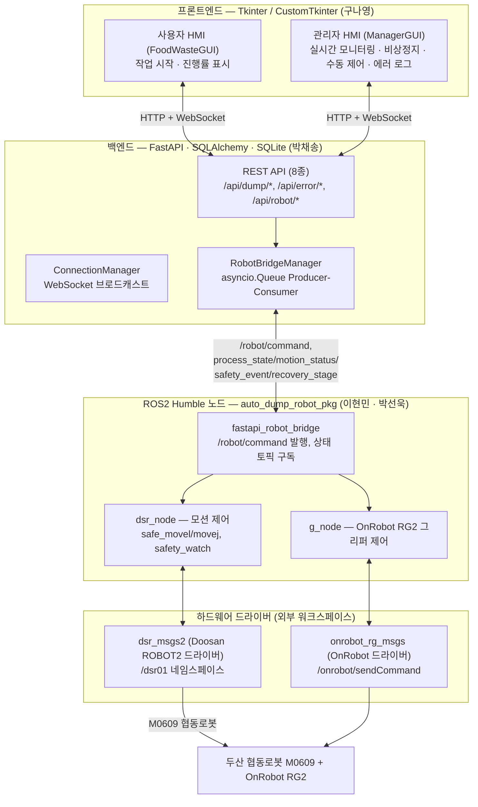
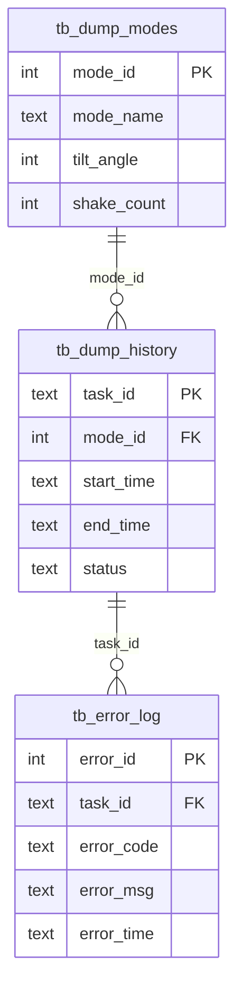
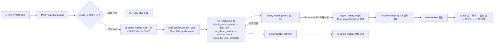

# 🍽️ 협동로봇 기반 음식물 쓰레기 자동 수거 및 세척 무인 시스템 (AUTO-DUMP-BOT)

**팀 프로젝트명:** AUTO-DUMP-BOT
**팀명:** TEAM B-4 (구나영 · 박선욱 · 박채송 · 이현민) · **멘토:** 이일주

본 프로젝트는 **두산 협동로봇 M0609**와 **OnRobot RG2 그리퍼**를 기반으로, 음식물 쓰레기의 **파지 → 배출 → 흔들기(잔여물 제거) → 세척 → 원위치 복귀**까지 전 과정을 하나의 무인 자동 프로세스로 수행하는 End-to-End 자동화 시스템입니다.
ROS2(Humble) 로봇 제어 노드, FastAPI 백엔드, Tkinter/CustomTkinter 기반 사용자·관리자 HMI 3계층으로 구성되며, 외력 감지 기반 능동형 안전 제어와 체크포인트 기반 비상정지 복구 로직을 갖추고 있습니다.

> 참고 자료: 팀 발표자료(`auto-dump-bot 최종 PPT.pdf`) 및 GitHub 저장소 [`Rokey-B-4/auto-dump-bot`](https://github.com/Rokey-B-4/auto-dump-bot)

> 발표자료 및 시연영상 링크: https://drive.google.com/drive/folders/1HgJJUFLrXR3NEuuhsMuC4EJS37tfkn0L?usp=drive_link

---

## 📌 주요 기능 (Key Features)

### 1. 5단계 End-to-End 자동 공정
쓰레기통 수거 → 내용물 배출 → 잔여물 제거(흔들기) → 밸브 세척 → 원위치 복귀까지 사람의 개입 없이 자동 수행합니다.
- `check_system_ready()`: 홈 위치 이동 → 그리퍼 Open → 센서 점검
- `pick_bin()`: 접근 → 하강 파지 → `is_grasped()` 확인 (실패 시 `ERR_PICK`)
- `run_dump_motion(mode)`: 배출 모드 1(일반)/2(강하게 털기) 선택 실행, `move_periodic` 기반 주기적 흔들기(5회) 후 복귀
- `execute_wash()`: 세척 지그 안착 → 수도 밸브 제어 → 오수 배출
- `return_bin_and_complete()`: 수거통 원위치 복귀 → 홈 포지션 복귀

### 2. 능동형 안전 제어 (Safety Watch)
- `safety_watch()`가 모션 수행 중 **10ms(0.01초) 주기**로 비상정지 플래그·외력·파지 상태를 실시간 감시합니다.
- 합성 외력이 `COLLISION_FORCE_N(40N)`을 초과하면 즉시 `trigger_safety_stop()`을 호출해 정지 → 상태 발행 → 안전 이벤트 발행을 하나의 절차로 처리합니다.
- `require_grasp=True` 구간에서 수거통 이탈이 감지되면 `ERR_DROP` 이벤트를 발행하고 예외 흐름으로 탈출합니다.
- `safe_movel()` / `safe_movel_relative()` / `safe_movej()`는 `amovel`/`amovej`/`amove_periodic` 비동기 API로 모션을 시작한 뒤 `check_motion()`을 10ms 주기로 폴링하며 `safety_watch()`를 함께 호출해, 이동 중에도 정지 명령과 충돌 감지가 즉시 반영되도록 설계했습니다.

### 3. 체크포인트 기반 비상정지 복구 (RecoveryStage)
- 비상정지(`EmergencyStopError`) 발생 시 실제 로봇 컨트롤러 상태가 아니라 **프로그램이 마지막으로 통과한 의미 있는 단계**를 `RecoveryStage` Enum(약 30개 체크포인트)으로 기록합니다.
- HMI/ROS2 토픽으로 `RESET` 명령을 수신하면 세척 위치·배출 위치·밸브 상태별로 분기하여 안전 경유점(Waypoint)을 거쳐 완료된 동작은 건너뛰고 **남은 동작만 이어서** 공정을 재개합니다.

### 4. 병렬 스레딩 구조 (공정 수행 중 명령 끊김 없이 수신)
- 배출·세척 등 전체 공정은 `threading.Thread`에서 독립 실행되고, ROS2 명령 수신은 `MultiThreadedExecutor(num_threads=4)`가 병렬 처리합니다.
- `dsr_node`(두산 로봇 모션 제어)와 `g_node`(OnRobot RG2 그리퍼/센서 제어)를 독립 Executor로 분리해 서로 다른 동작 주기 간 충돌(Deadlock)을 해소했습니다.
- 공정 수행 중에도 비상정지·RESET 명령을 끊김 없이 수신할 수 있습니다.

### 5. ROS2 ↔ FastAPI ↔ HMI 실시간 연동
- `asyncio.Queue` 기반 **Producer-Consumer** 구조로 ROS2(스레드 기반)와 FastAPI(AsyncIO 기반)의 서로 다른 실행 모델 간 충돌을 해소합니다. (ROS2 브릿지가 큐 적재를 전담 → 백그라운드 태스크가 큐를 꺼내 WebSocket으로 브로드캐스트)
- REST API 8종 + WebSocket(`/ws/robot/status`) 1종으로 작업 시작/이력 조회/에러 로그/비상정지/리셋/관절 수동 제어를 지원합니다.
- 작업 이력(`tb_dump_history`)·에러 로그(`tb_error_log`)를 SQLite에 저장해 이력 조회를 지원합니다.

### 6. Virtual Mode 시뮬레이션
- 실제 하드웨어 없이 `mode:=virtual` 파라미터로 전체 공정을 사전 검증할 수 있습니다. Virtual 모드에서는 `is_grasped()`가 항상 `True`를 반환해 파지 성공을 시뮬레이션하며, Backend/Frontend 기능·UI·API 통합 테스트가 가능해 개발·유지보수 비용을 절감합니다.

### 7. 사용자 / 관리자 HMI
- **사용자 HMI** (`FoodWasteGUI`): START 버튼 → 배출 모드(일반/강한 흔들기) 선택 → 통 배치 안내 → 진행률·완료 화면까지 8종 화면 제공.
- **관리자 HMI** (`ManagerGUI`, 사용자 HMI 내에서 호출): 공정 실시간 모니터링 및 원격 비상정지, SAFETY 안전 상태 보강/인터록 해제/시스템 전체 초기화, J1~J6 관절 슬라이더 기반 수동 제어(MoveJ) 및 그리퍼 개폐, 에러 로그 조회 4종 화면 제공.

### 8. 예외 상황 대응 시나리오
| 상황 | 문제 | 대응 |
| --- | --- | --- |
| 쓰레기통이 정위치에 놓이지 않음 | 그리퍼가 통을 인식·파지하지 못해 픽업 실패 | 안내 팝업 표시 후 "처음부터 다시 시작" 또는 "이어서 재개" 옵션 제공 |
| 수거통 이동 중 충돌 (파지 전) | 통을 아직 파지하지 않은 상태에서 충돌 발생 | 모션 즉시 중단 → Home 위치 복귀 → 공정 재시작 |
| 음식물 처리 후 충돌 (파지 후) | 충돌 시점에 따라 다음 동작을 다르게 판단해야 함 | 직전까지 수행한 동작을 Checkpoint로 기억 → 남은 동작만 이어서 재개 |

---

## 🛠 시스템 설계 (System Architecture)

### 전체 구조 (3계층 아키텍처)



| 계층 | 역할 | 주요 구성 |
| --- | --- | --- |
| Frontend / HMI | 사용자 작업 시작, 관리자 원격 제어·모니터링 | Python, Tkinter, CustomTkinter, CTkMessagebox |
| Backend | REST API, WebSocket 실시간 브로드캐스트, 작업 이력/에러 로그 DB | FastAPI, Uvicorn, SQLAlchemy/SQLite, asyncio |
| ROS2 제어 | 협동로봇 모션 제어, 안전 감시, 그리퍼 제어 | ROS2 Humble, rclpy, DSR_ROBOT2 API |
| 하드웨어 드라이버 (외부) | 실제/가상 로봇·그리퍼 구동 | `dsr_msgs2`(Doosan), `onrobot_rg_msgs`(OnRobot) |

### ROS2 노드 구성

| 노드 | 역할 |
| --- | --- |
| `dsr_node` (`food_waste_dump_robot_dsr`) | 두산 협동로봇 M0609 모션 제어 (movej/movel/amove_periodic 등 DSR_ROBOT2 API 호출) |
| `g_node` (`food_waste_dump_robot`) | OnRobot RG2 그리퍼·센서 입출력 제어, `/onrobot/sendCommand` 서비스 클라이언트 |
| `safety_node` (`food_waste_dump_robot_stop`) | 외력 감지·충돌/이탈 상태 판단, 비상정지 우선순위 콜백 처리 |
| `fastapi_robot_bridge` | ROS2 ↔ FastAPI 백엔드를 잇는 브릿지 노드. `/robot/command`만 구독하고 나머지 5종 상태 토픽은 발행을 구독 |

세 노드는 `MultiThreadedExecutor(num_threads=4)` 위에서 동작하며, `dsr_node`/`g_node`를 독립 Executor로 분리 실행해 서로 다른 동작 주기 간 Deadlock을 해소했습니다.

### 주요 ROS2 Topic / Service

| 구분 | 이름 | 설명 |
| --- | --- | --- |
| Sub (로봇 노드) | `/robot/command` | HMI/백엔드 → 로봇: START, EMERGENCY_STOP, RESET, RETRY_PICK, HARDWARE_CONTROL, MOVE_JOINT |
| Pub (로봇 노드) | `/robot/process_state` | 공정 상태 (IDLE/INIT/READY/MOVING/DUMPING/WASHING/COMPLETE/PAUSED/COLLISION/ERROR) |
| Pub (로봇 노드) | `/robot/motion_status` | 모션 진행 상태 |
| Pub (로봇 노드) | `/robot/safety_event` | 충돌/이탈 등 안전 이벤트 |
| Pub (로봇 노드) | `/robot/recovery_stage` | 비상정지 발생 시 마지막 통과 체크포인트 |
| Pub (로봇 노드) | `/gripper/status` | 그리퍼 파지 여부 (Bool) |
| Service | `/onrobot/sendCommand` | OnRobot RG2 그리퍼 개폐 명령 (`onrobot_rg_msgs/SetCommand`) |
| Service (외부 드라이버) | `dsr_msgs2/GetRobotState`, `dsr_msgs2/MoveStop` 등 | Doosan 드라이버가 제공하는 로봇 상태 조회/정지 서비스 |

### 데이터베이스 설계 (ERD)

SQLite 3개 테이블, PK/FK 관계로 구성:



### REST API / WebSocket

| Method | Endpoint | 설명 |
| --- | --- | --- |
| POST | `/api/dump/start` | 배출 작업 시작, `task_id` 발행 및 DB에 `INIT` 상태 기록 (REQ-01) |
| POST | `/api/error/log` | 작업 도중 에러 로그 기록 (REQ-08, REQ-09) |
| GET | `/api/dump/history` | 배출 작업 전체 이력 조회 (최신순) |
| GET | `/api/error/logs` | 최근 에러 로그 조회 (`limit` 기본 50건) |
| POST | `/api/robot/emergency-stop` | 비상 정지 명령 (REQ-EMG) |
| POST | `/api/robot/reset` | 시스템 리셋 및 인터록 해제 |
| POST | `/api/robot/retry-pick` | 수거통 재파지 후 중단 공정 재개 |
| POST | `/api/robot/move-joint` | J1~J6 관절각 수동 제어(MoveJ) — J6=1.0/2.0이면 그리퍼 OPEN/CLOSE 우회 명령으로 해석 |
| WS | `/ws/robot/status` | 로봇 상태·이벤트를 연결된 모든 HMI 세션에 실시간 브로드캐스트 (끊김 시 3초 후 자동 재연결) |

### 공정 흐름 (Process Flow)



---

## 🖥 개발 환경 (Environment)

| 항목 | 내용 |
| --- | --- |
| OS | Ubuntu 22.04 LTS (Jammy Jellyfish) |
| Middleware | ROS 2 Humble Hawksbill |
| Language | Python 3.10 |
| Robot Control | ROS2 `rclpy`, `DR_init`/DSR_ROBOT2 API, `MultiThreadedExecutor` |
| Backend | FastAPI, Uvicorn(ASGI), SQLAlchemy/`sqlite3`, Pydantic, `websockets`, `asyncio` |
| Frontend / HMI | Tkinter, CustomTkinter, CTkMessagebox |
| Database | SQLite (`tb_dump_modes`, `tb_dump_history`, `tb_error_log`) |
| Containerization | Docker (`osrf/ros:humble-desktop-full` 베이스 이미지, `code/backend/Dockerfile`) |
| 버전 관리 | Git / GitHub |

---

## ⚙️ 사용 장비 (Hardware Setup)

| 구성 요소 | 비고 |
| --- | --- |
| 두산 협동로봇 M0609 | 로봇 ID `dsr01`, 모델 `m0609` (`DR_init.__dsr__id`/`__dsr__model`) |
| OnRobot RG2 그리퍼 (End-Effector) | Tool 이름 `GripperDA_v1`, 무게 0.9kg, `/onrobot/sendCommand` 서비스로 개폐 제어 |
| 파지 감지 센서 | 그리퍼 디지털 입력 기반 파지 여부(`is_grasped`) 판정 |
| 레고 블록 기반 모듈형 테스트베드 | 실험 환경 구축용 |
| 음식물 수거통 / 쓰레기통 / 세척 공간 | 실 수행 대상 실험 환경 |

---

## 📦 의존성 설치 (Installation)

### 0. 사전 준비 — Doosan / OnRobot ROS2 드라이버 (외부 워크스페이스)
본 저장소의 `auto_dump_robot_pkg`는 `dsr_msgs2`(Doosan 협동로봇 드라이버)와 `onrobot_rg_msgs`(OnRobot 그리퍼 드라이버) 패키지에 의존하지만, 두 드라이버는 이 저장소에 포함되어 있지 않습니다. 같은 colcon 워크스페이스(또는 오버레이 워크스페이스)에 두산 로보틱스의 `doosan-robot2` 계열 드라이버와 OnRobot RG 드라이버를 먼저 clone/build 해야 합니다.

```bash
sudo apt update && sudo apt install ros-humble-desktop-full python3-colcon-common-extensions
# doosan-robot2(dsr_msgs2 포함) 및 onrobot_rg_msgs 드라이버를 별도 워크스페이스에 clone 후 build
```

### 1. 저장소 클론

```bash
git clone https://github.com/Rokey-B-4/auto-dump-bot.git
cd auto-dump-bot
```

### 2. ROS2 워크스페이스 빌드 (`code/robot_ws`)

```bash
cd code/robot_ws
colcon build --symlink-install --packages-select auto_dump_robot_pkg
source install/setup.bash
```

### 3. 백엔드 의존성 (`code/backend/requirements.txt`)

```bash
cd ../backend
pip install -r requirements.txt
# fastapi>=0.110.0, uvicorn[standard]>=0.29.0, sqlalchemy>=2.0.0, pydantic>=2.0.0, websockets>=12.0
```

또는 Docker로 실행:

```bash
docker build -t auto-dump-bot-backend .
docker run --rm -p 8000:8000 auto-dump-bot-backend
```

### 4. HMI 의존성 (`code/hmi_app`)
별도 `requirements.txt`가 없으므로 아래 패키지를 수동 설치합니다.

```bash
pip install customtkinter CTkMessagebox requests websockets
```

---

## 🚀 실행 순서 (How to Run)

### 0. Doosan / OnRobot 드라이버 기동 (실물 로봇 또는 DRCF 시뮬레이터)
외부 워크스페이스에서 두산 로봇 드라이버(`dsr01` 네임스페이스)와 OnRobot RG2 드라이버를 먼저 기동해 `/dsr01/...` 서비스와 `/onrobot/sendCommand` 서비스가 준비 상태(ready)가 되도록 합니다.

### 1. ROS2 로봇 제어 노드

```bash
source /opt/ros/humble/setup.bash
source code/robot_ws/install/setup.bash

ros2 run auto_dump_robot_pkg motion --ros-args \
  -p mode:=virtual \
  -p dump_mode:=1 \
  -p autostart:=true
```

| 파라미터 | 기본값 | 설명 |
| --- | --- | --- |
| `mode` | `virtual` | `virtual`(하드웨어 없이 `is_grasped()` 항상 True로 시뮬레이션) 또는 `real`(실제 로봇 구동) |
| `dump_mode` | `1` (`DUMP_MODE_NORMAL`) | 배출 모드 — 1: 일반 배출, 2: 강하게 털기 |
| `autostart` | `false` | `true`면 노드 기동과 동시에 공정을 즉시 시작 |

### 2. 백엔드 서버 (FastAPI)

```bash
cd code/backend
source /opt/ros/humble/setup.bash   # rclpy 브릿지 임포트를 위해 ROS2 환경 필요
uvicorn main:app --host 0.0.0.0 --port 8000
```
Swagger 문서: `http://localhost:8000/docs`

### 3. 사용자·관리자 통합 HMI (Tkinter)

`hmi_app` 패키지 내부 상대/절대 임포트 구조상, `code/` 디렉터리를 기준으로 **모듈 형태로 실행**해야 합니다. 관리자 화면(`ManagerGUI`)은 사용자 HMI 내부에서 호출되므로 별도 실행 파일이 필요 없습니다.

```bash
cd code
python3 -m hmi_app.design.main_gui
```

기본 접속 대상은 `http://localhost:8000` (REST) / `ws://localhost:8000/ws/robot/status` (WebSocket)이며, 백엔드가 다른 호스트에서 구동 중이라면 `hmi_app/api/api_base.py`의 `base_url`/`ws_url`을 수정합니다.

### 4. 동작 확인
1. 사용자 HMI에서 **START** 클릭 → 배출 모드(일반/강한 흔들기) 선택 → 안내에 따라 수거통 배치
2. 백엔드가 `/api/dump/start` 처리 후 `/robot/command`(START)를 ROS2로 발행
3. `dsr_node`가 5단계 공정을 순차 수행하며 `/robot/process_state` 등을 실시간 발행
4. 관리자 HMI에서 실시간 모니터링, 필요 시 **비상정지** 버튼으로 즉시 정지 가능 → 조치 후 **RESET**으로 체크포인트 기반 복구

---

## 📁 폴더 구조 (저장소 기준)

```
auto-dump-bot/
├─ code/
│  ├─ backend/                 # FastAPI 백엔드
│  │  ├─ main.py                # 앱 진입점, Queue Consumer, WebSocket 브로드캐스트
│  │  ├─ config.py               # 환경변수 기반 Settings (포트/DB/ROS 토픽 등)
│  │  ├─ database.py             # SQLite 연결 및 테이블 초기화
│  │  ├─ models.py               # Pydantic 요청 모델 (TaskStartRequest 등)
│  │  ├─ connection_manager.py   # WebSocket 연결 생명주기 관리
│  │  ├─ robot_bridge.py         # ROS2 ↔ asyncio.Queue 브릿지
│  │  ├─ routers/robot_router.py # REST API 라우터 (/api/*)
│  │  ├─ requirements.txt
│  │  └─ Dockerfile
│  ├─ robot_ws/
│  │  └─ src/auto_dump_robot_pkg/
│  │     ├─ auto_dump_robot_pkg/
│  │     │  ├─ motion_controller.py  # 노드 생성, 파라미터, main()
│  │     │  ├─ motion_runtime.py     # 안전/모션 함수, safety_watch, RecoveryStage
│  │     │  └─ motion_workflow.py    # 5단계 공정 워크플로우
│  │     ├─ docs/motion_controller_분석.md
│  │     ├─ package.xml
│  │     └─ setup.py                 # entry_point: motion
│  └─ hmi_app/
│     ├─ design/                # user.py(FoodWasteGUI), manager.py(ManagerGUI), main_gui.py
│     └─ api/                   # api_base.py, api_user.py, api_manager.py
├─ docs/notice.txt              # 백엔드 아키텍처 설계 노트
└─ README.md                    # 본 문서
```
